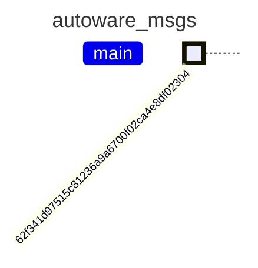


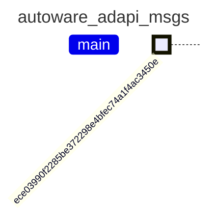


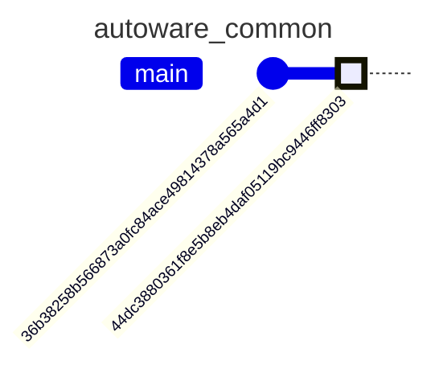


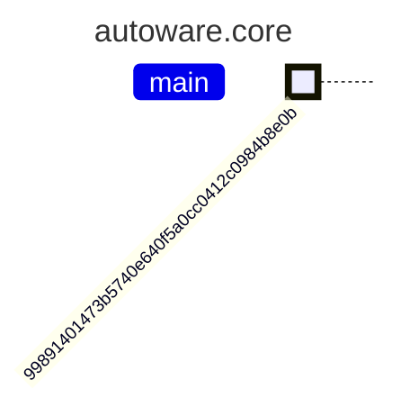


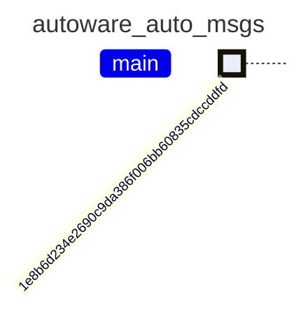


```mermaid
---
title: autoware.universe
---
gitGraph
       commit id: "c75d581016c559e7bd8a6bf3e63b173c13e30d63"
       commit id: "0d0a22c175a333a487f434c01da2ebb15621db24" type: HIGHLIGHT tag: "successful"
       commit id: "48568b737e07d580c66e2819aa6c15bd94a10a42"
       commit id: "45b05031b3ed3fa83033b2e7c3763115b121d589"
       commit id: "64d80800c500d574bc14c1b65028f2fbfeeebc53"
       commit id: "e67badaf95f53e049b2360f8c3c24025935942f7"
       commit id: "eaf9f684dc092ee1681221b7e724081ff1f0833f"
       commit id: "b0196439a149318a10f4cb3a22d2ee7a541ff886"
       commit id: "2ad1d816fa1bd31e0976fc9679c98ae2a9d56d4b"
       commit id: "89db33569a0b9a5e01c752b69dc3f4014db1be15"
       commit id: "8530b6bb4155b040f8ff845ec030aa836218b94e"
       commit id: "c6278ceace794c01cdd6bdefc460a90a77793167"
       commit id: "a92b251516c0fdd2c8a7625fe725dfc25c046ba8"
       commit id: "9a7fac5dd38294990a3a0be40f1837e349d38027"
       commit id: "992584bb6b03c04bf189567be055f67c962b038f"
       commit id: "5d175014c4972fead53a39ffb46d20fb8034f5e0"
       commit id: "264accb7086239e6c128478bf0f548138db59068"
       commit id: "a39b20d95200527726284101a0030dad08aa5a59"
       commit id: "22a5ced2c7a4d4b9421b508cf90e4d9018a073c9"
       commit id: "f0ea398bd5fe71e51eb80116f0a29c035e2843a4"
       commit id: "16217e849b65047525c2c080cfca9ab77149f788"
       commit id: "5c220226e06f94416ee7794ae40a165a76680799"
       commit id: "b3bdedc584682fe6ab6310af4792312c36521e74"
       commit id: "c65bccd981cae83eac8f4b85d688d297db49ad1b"
       commit id: "86a59542d1ef6ec24e168832f9c35bfa2af66e73"
       commit id: "b71b04e52e62eb23b2affb6fdcf1bab59b1de298"
       commit id: "8453525fcc9dace38b0780d791e890ce2a2461b1"
       commit id: "076319bef0e92f23497b05be1e7f9e8de9bdebef"
       commit id: "08f6b8de901ca70df1705d420df0b596958e0794"
       commit id: "d38beae3097fe614806f0b900b7b6417291c5c10"
       commit id: "0c7ef9863fc95918731abee39375fc7779fd4976"
       commit id: "3a1d48076ed7e42fa9e6a47df285979e372f761a"
       commit id: "68252008c60103d36b9f1e9d6ee36782968767bc"
       commit id: "3f2230f0c734c15f148e3b68a349ca0325be09ee"
       commit id: "99cb32208cd079989f91f69d245d8099c8309eb9"
       commit id: "738c3763c28c16f537c0f0305f9cc66531b710ea"
       commit id: "fb35f6216ae57ec72ff30f173198d2d70ba99f31"
       commit id: "dad4722a309cca23304bf449cd7a266db942efb9"
       commit id: "78d4d8247fda3192f8b7032286b56c81fce74c4e"
       commit id: "dbc6de6f15507f6132247e4a875a1404db814bc3"
       commit id: "35cf82eefa96326b5d6f9754405387299ea7a752"
       commit id: "5725c2daf9b6d00a5f52abe028641af7c71dc192"
       commit id: "95e8f212a6a8b5eb92941ae0d4d8dc997970de25"
       commit id: "5d6449defe3309b5fc7a438eaa511e5d1985c0cf"
       commit id: "b266f47aeaf85088e02ff851e544757634ceb076"
       commit id: "1c5ca20218a1968888e42fd30cf535aa24dcc79f"
       commit id: "d1a77d59fc6b676e94bd9ef62a644c310b676c3f"
       commit id: "4383d6bcfcd5df6ec4f0b15e28ea501c2024b7ba"
       commit id: "8b1f3c0c58e78d6946a27773e51d1f36c9334581"
       commit id: "def9ffc14a91a89e417f82d5ee6aafbc17944058"
       commit id: "c03b5ac3abde3e4240e6c36d77c8bc939df90ea8"
       commit id: "d9abd595eecd73796ba4fd481c9f395760c187be"
       commit id: "910f30bcd776b48b9c7dadcc3b638236aa4006ab"
       commit id: "61c7e3205466fd6bd80a8fa6432f268d65a788d2"
       commit id: "f1cf22b1d44b20a33e7df1533bef5a8854e29562"
       commit id: "df836214c7443f4ad92e5abc9ee601c1cae4bf5b"
       commit id: "69560ad3f1ccf7576329c75efdc5ec3d11d94d88"
       commit id: "21acc282c523ce05c36fb59c70cb5b4a076e5ae8"
       commit id: "bcfae36caf2fd0948202c0c4992ae356239265d0"
       commit id: "7e0031e988e41ad1124f241d202802dc3b7f671a"
       commit id: "e56698836e9c6491dd904c5178946639d37c89aa"
       commit id: "d8f285bf81ce33f55b604745cbdf91f8cc005af6"
       commit id: "744d48d0e3aaf9693062b44eb4c1edabc9659f6b"
       commit id: "4ba8923dd064b21749814f14bd30a5a97bd81e2e"
       commit id: "d5709ab4ffc99478042913a411ee57a4b50e0aa7"
       commit id: "3cf0481b9b796d1a2dd325601467f5f98cd509ab"
       commit id: "75debf01597726df68399519777fd0f78f15dc84"
       commit id: "02eb8434ed634b93c334bab26825fd97cbc94ab3"
       commit id: "f872838baeeb43e4d8bf10140676ce75151d09a1"
       commit id: "bc60bbfb659be580f6e8aa894d2f16b9afbb4c0d"
       commit id: "a220a96169e8c6b7b214493451f10447070a59dc"
       commit id: "bc1d6c74afe7ac2af57d43b10320a1635113bb89"
       commit id: "021d54057b4d9163248885e06ecd8a89a4f943cb"
       commit id: "10bb43cab859d90802ffbfe6114885726974fdb4"
       commit id: "79e64d832c979e0cceae48e4eab2d1459db85113"
       commit id: "29279a0f736c7c6c02cccd2c782a5a1b792fb0b2"
       commit id: "e58eb3262d81a1f1bdf6730c0e42c5b8fad148f6"
       commit id: "7e0ee1eba48862ec0a6579e3db578c128aa4d8cb"
       commit id: "6b58314939716775b7253c07f1140928af4e28ac"
       commit id: "84995ec3ca4e201ed1d800c0eeb967de25298f84"
       commit id: "dc8cc07bfebeed7aef328891a720bfc17899726d"
       commit id: "9fe7626889668b80298c7aeeba3068b6b622fc73"
       commit id: "671cc9658f8ccf52de03089f7b1ddc9e6c59a2a5"
       commit id: "3a8ff49eb0da121c6c0a28546f0853d5853f57d4"
       commit id: "2aa9d1cd68b81df7b154195e7243f3e872256b8e"
       commit id: "82d9840bc16dd380e2509e4fdac6d0be041f1796"
       commit id: "45339f63a05434cceaabbb2fa2d162b96e11d275"
       commit id: "b36bc09b982f3f7b95c7c5164fa436b5b313ca00"
       commit id: "adb4872de9bedac1ff7440b135e741d5da2336ae"
       commit id: "9ddb07ae06c269d8cf007bab8fe402c24de54223"
       commit id: "c508aa71c19d09f4198e24cd93c39191c9dacca6"
       commit id: "83821d4818cf83ea3bcb14511fc64482859ed7f1"
       commit id: "0c48944c343cd74a2acb26cf428f113eb536a7f6"
       commit id: "057d3d4259f69e0c83e7897a954ddac3f4818fcc"
       commit id: "950805fda122ac31f9784e841ac5106b201bc1ca"
       commit id: "6dfb197f95771421a7fc9acbdafe2028856ce789"
       commit id: "e12817df60b2579b1be513950d463b6652c4e717"
       commit id: "b0310e769c9184e70a3b2eecd616cd1eb066fd18"
       commit id: "8e971bcc8ef480e2791e436d7eb979f82d324e54"
       commit id: "877b04b133175fc39444a9400cd83ae8f22de5b4"
       commit id: "dd275bf94e78e5c18d43a2228759812c267d2184"
       commit id: "02fda2f44217bdd57690302460f16ff3b9c4dcbe"
       commit id: "c763eda68ede1ccc5b50290cb61f5775061aa212"
       commit id: "8649d930353151e4fc656e5f2b8a67f2de35f535"
       commit id: "98004cedb5059b863f6c964cbacf6812736bd52b"
       commit id: "8770e1e7ff25d951b539b7d48f4e30024aa15cd8"
       commit id: "36c17b338e390a7f40e1f0ee216c95e9354675f3"
       commit id: "5fed746365fd647c61eae400fbddc304088b9d4c"
       commit id: "bc6806390ffbe07b91d23e2a7ceea641280aa03a"
       commit id: "9cf1f7cc4f8255dce34273eb8aba4ec59a1797a7"
       commit id: "26e3be8569945733f2e76ba59a7077ccb0c29fab"
       commit id: "a9bb25adda3f33adefaf5cccbc3402307a0f2e52"
       commit id: "6155f1ff63b95492f5d62250bda03334efe416c7"
       commit id: "8a0ff1cfaa2c5a8afd47a280bd67db435f799146"
       commit id: "ac06a5c2e05bc166478d1ff5e0d730471089a41c"
       commit id: "68544c73bffca2b5acbaab299303f64653b6be8d"
       commit id: "9aa2e5a8fdabe62c86dfec5d56de128f5e6ab6aa"
       commit id: "1c2c59d0ab81400b692aa8d9c3b595be0222b9ab"
       commit id: "81ede03f749d46fb3eed3c9e96ce9d993acaf8c3"
       commit id: "58a513efabcce9b93d1bc2ee4639d7b15b852038"
       commit id: "8c3812603173b68ec8fc3c5b7b300e170fa2bea6"
       commit id: "8ab910ba8dd3ff4fd09d149d6857b629b3cf9b0b"
       commit id: "6e49e8297c915a0c68aaae7663d1ad89d4863221"
       commit id: "ccf9235e7a5537ed83aea451216ac963487cbd36"
       commit id: "a6af44eaf534a3c96e4bdb3b483f3eb99548027a"
       commit id: "e7bc187a9f4f86cbb7712e5fa9086a70d5b4652f"
       commit id: "bab14534a60e5741bd57b70979035bdc874c65cb"
       commit id: "de07fb8011cb9330b435e13dadac74c875f9bae2"
       commit id: "c6b802fc2908592cb4f27ae12feb6ca42015a51e"
       commit id: "89404e6070a43526f86a0bc88b231865ce2344af"
       commit id: "93b61184520d93ab8bcdb653f51d94a2de5bfbf9"
       commit id: "14ef695b33325ac946438063278a16d1835c18f0"
       commit id: "a44830788f70b4e84ccdd874d56eea2e84d7ca1b"
       commit id: "3c5a0b84d195a60f045c5e829024d085c77735a2"
       commit id: "de83f251d3e9bc9399530107df5ab4e938c3413f"
       commit id: "c99c6b2fc7062e6e21edb80a1b96797f59d04efb"
       commit id: "b32f8ef5f1791c268aab7265937e87f8eb23ad69"
       commit id: "e337576f8a22a015df9a21f21e4beb12bbdae2b7"
       commit id: "ad69c2851b7b84e12c9f0c3b177fb6a9032bf284"
       commit id: "ec305031e8cfa50c4da58ebe6b4bde1e99bc5b3c"
       commit id: "e32ed7252a4a8aa4ed171d8714ffa73fdbcab2fc"
       commit id: "1caa1b3eeff0190255edb6331753b9f7f752e151"
       commit id: "ee7c3452489fb39df1e242d5710acf9f143fd24d"
       commit id: "952753f86b1408e011c178193604b7aa8d88f90c"
       commit id: "aa90375c9ff67081c7968036b12c747e51ebb3f1"
       commit id: "22d595904e783b4b5fdd2f5790e3ff16791176a9"
       commit id: "a48e80bc9cbaa0d04d59b263fbd8cd7cce148886"
       commit id: "dea2b074400a7af8e66f0828fd8f3b44a4bbe585"
       commit id: "d4ceaa6e5fe259c9fc4ad41a9761ffbf51decf0a"
       commit id: "376ca2d76793be6e3d06c7ca6f8172274e634f99"
       commit id: "684a4ccc4b58975359a6ffcca1cbeb7e32e0706a"
       commit id: "32d2b8437578de4abc35f417cbead557159105d0"
       commit id: "fe9ad68131936f96f231dbd3b3fb72746b10c51b"
       commit id: "a3e16df9acaa86c05792dd7d03d593758caffa81"
       commit id: "3eda01859adbbc4c72f859880a76374b2d023273"
       commit id: "7e9b4dedd71a88472233e9f6f20d16bd7e54baf2"
       commit id: "c56423ddcc6420089952ccb24bc171f9c199620c"
       commit id: "17984b455b9f327a0942b0084c89c1bceab7a959"
       commit id: "32c2e67ce4be25475120ff7599381d53dac60dd0"
       commit id: "c552c3dedc82f61015a918e505375d0bd04cde6c"
       commit id: "f2263e1c00212a01fe8608de022904bbda8ca2d7"
       commit id: "4558485999f2e0f063d0b3b5362d5246e08b6a12"
       commit id: "639d5c0098c4806764a7c9e25a377a01c3f8bc5f"
       commit id: "f2ffc668e79cc09a3a637c2b0db191ed39056866"
       commit id: "d27efb28be8e95c75291c64dba94825552577369"
       commit id: "b98abd2954fef7e6e8379d7dd128d6edcb76e909"
       commit id: "0cd4f625d255f36d5ff55c571292625cb0272af9"
       commit id: "c7d3d0ea9baca4f5b3a6f85f2ddefff190939a05"
       commit id: "c6701df78115db83c3671be4f314cc0569f90a6b"
       commit id: "154da3dd0c8f14da051247e8ff885a18b59fc560"
       commit id: "7149338b3de32122b8db394b193bce0a781a8865"
       commit id: "0f19d71c8013ecf210a670dc8bf4d42f9e5d23bb"
       commit id: "0373d21a7f7dcbd64e96ebc7a3b08275e391656a"
       commit id: "3731fd08385cd391c30f35a44b9a94dedfc29ea6"
       commit id: "bb89363a631164aefbebb6dbf8698d8149b703ed"
       commit id: "7fdda423eb363f05625f7b26ac67b322cb8473a5"
       commit id: "5715e44352511f3c06ef364bd0294aa987b39d51"
       commit id: "a596ce2466be35b44a0a98cd73b622a7d22c3c6a"
       commit id: "11206eb5d03157a880b56f2afa4841b7cdf4fe77"
       commit id: "79d76cac890d9ab969285eca85feb10ca52edb39"
       commit id: "05f8ad257db57b0ee700783b8f532f0a1d08ac53"
       commit id: "9a8a043f646b2909b321b2c727d683b21ce2eb5b"
       commit id: "68ee0f220fcd3e4f0ed9276270008d04fd579120"
       commit id: "19ab508c3d590101d8fcb9ffca1248adebd895f3"
       commit id: "078be98b55162509f0f837b62a7581e03a77aa7a"
       commit id: "72e78559f669bf1c0646601ea4a2a432ddf6b86d"
       commit id: "32f0547d62e0e031708dc92ea59de254e1de56a5"
       commit id: "1ca5dc1dffb6e95654cfe7528a1deee356c0e8b2"
       commit id: "0153e543633449a3ddbcbe57322b6ffb01def8dd"
       commit id: "16dc5358ee9ac3934190c0f09fb9d782500cb91d"
       commit id: "443386dd2ace28cd21f12e350e82cea98df38c1f"
       commit id: "231459f3bb1bff2b07cac9aa367736a1bf52d712"
       commit id: "d9ab02a8c7edce0f7bba452aeb8a97486d37c5d0"
       commit id: "46f871fdc6df53f9dce615ce8a132e3d3d139c14"
       commit id: "dcbd0626243aaf6f14725085cd22b953373b6261"
       commit id: "403c4de75e4eec4733af66ea904431af213d91b4"
       commit id: "9e4b4e924f17bd40ec97b975cbb8ada9fc06ff8d"
       commit id: "770cf1714bae4f7d2367bbb499d9a6a5f6ea33e3"
       commit id: "29e67e7f562534ad0a00563d7f3263fc780fb4bf"
       commit id: "71da68ce1dc1a8c32a9ce5103908df9b65850af5"
       commit id: "f7a1b16d2c61c4aba6e1c63b9ef0fa848e640352"
       commit id: "eeab6c09cdda6bc5321397fb1ee125c3b62ff248"
       commit id: "092ecea44c3e38242ca4b1d5b27a9fc4c86a8a26"
       commit id: "7f98ecfd9e6a12f4a506fe52f1bdd1a6302d17cc"
       commit id: "367686bc8c8454bcc47f7962408ffd643f4fa7d1"
       commit id: "5b92c71ba22aea5c0564d21fe6ea2f1e92cf5640"
       commit id: "e2123a2146f0ba44be65b3604a26b5d3f2c60699"
       commit id: "b6446b0e91d5230d27a8bbc2c64ec19b082e40de"
       commit id: "a73bbf97c9d833a05bb8533e7bebb8f9b8d51fb6"
       commit id: "617a6273be90e2130618b08eeae5f97121137c72"
       commit id: "460fc46c290746e7a04a6148f74b7ef828c668a9"
       commit id: "7b1999ab8a7c1ab7fa1402b39d423e11b38cfc91"
       commit id: "6006146dcff9cf68265f9f155adcf7dc2fa69528"
       commit id: "7af40fc9ff9beabae4c8842b21153ba977513cbf"
       commit id: "1276da93b382e3f3a64d3154f53b7f9562ad074c"
       commit id: "ec99b2f2218f6b27a0f9567480df73fe1ed2aea6"
       commit id: "1ada5673e3ba561a23cf41cee825b9eec9a76dfd"
       commit id: "a4c94ccc7b02c8aea3a899dd6dbc4cf1ce406945"
       commit id: "837699ba34d8ae06c2ff436b8b2c48dd840f6dbb"
       commit id: "499152149e3e01263f93845e947e73f748a7e065"
       commit id: "19114642146db7312a35f7b5841878207776ea6a"
       commit id: "fe19de9e13e01bd7400259a86cb40b3e45c9d2c0"
       commit id: "d8885f92c69dae3a10623675d1bda58eb913b8e9"
       commit id: "b58c009ce5875b73cf385884f3eafe75b983c8a9"
       commit id: "44fb0fd3b0da4cf39da19216cd5dada4dbcecbb0"
       commit id: "12d83338a2d66bf23157c0d8f109a217cc0a3a88"
       commit id: "f09e1b75addde381e7bbfb32444a75927a832169"
       commit id: "bf03fe31bdfbc036a661fdcfd8c062a1d90fb306"
       commit id: "4c9146eec95a319ecbed2618e24f6a3e72734b2d"
       commit id: "df6228617d1348828eaea592b74c10e32a752524"
       commit id: "2aa9c7b1db4c0fc7d602feb4984b4d64db5265d4"
       commit id: "1a5aa69f46c8b40549b92cabce85efd3864768f2"
       commit id: "cd2cd521c9b3058e2c677f0f0e2a7ae997feaa7e"
       commit id: "68e64acc2809b2970d78210bcce44c28518923a3"
       commit id: "b87bfac785f4cbf8a8b29d5a4dc2240d456df466"
       commit id: "e0bcedc3651e45bb060c113f044e29ca9e4676c3"
       commit id: "3fd7b7c542baea2de5963efc049efe51f29ad41f"
       commit id: "4dd69604b465c0662fc7dcb56f26e375af1d321e"
       commit id: "18ad7447e4930e3d9fc38231dd24cf3be32b7818"
       commit id: "9991b9ae525b79eb9c12f687baf8eab340c79166"
       commit id: "55fba784cb3c15b240e3bbef322990da1dc2c30f"
       commit id: "ffcbae075164f2cbbec53784ade90578a8a705ab"
       commit id: "a84418ac2e4c8fd3baa98420b468b903726b6390"
       commit id: "08c809ce2e8227581754738c719504f08628f10d"
       commit id: "7956761ea210e620c6111cb41d55e3ce361b497e"
       commit id: "c4a7e5466a35c38458d8494e7bfc4360aad16b2d"
       commit id: "08122d90bc21b7b6e20e9d8e7b0b1f4efd072e17"
       commit id: "89b16e8b93cca0dfe7ce82bee52dd64f8dc20cec"
       commit id: "e942c2de3db90652b4dfdee888ca9f5dc35c8d7c"
       commit id: "057c2d50b59aee1d3f31e3f4dce27d543fc1fa6c"
       commit id: "d2c2de298c32f79915d0c690c2a7c6c656d09f00"
       commit id: "326868b1611c350273653c114c0054d97a735cd6"
       commit id: "e68e6e2b3bdb11dbea44a1a565cff8fea73acbbd"
```


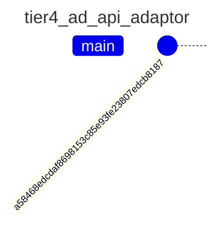


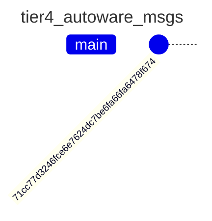


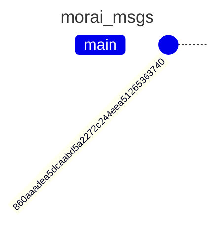


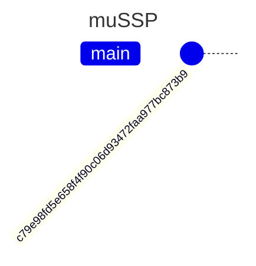


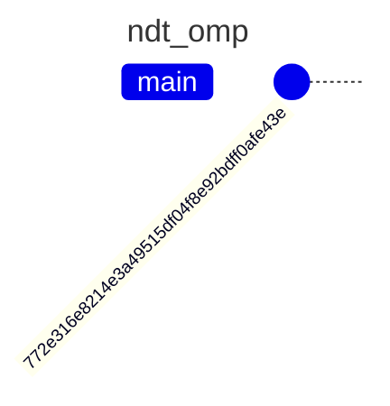


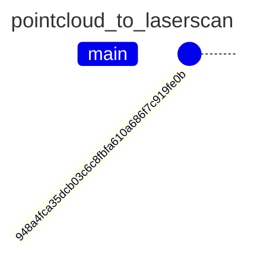


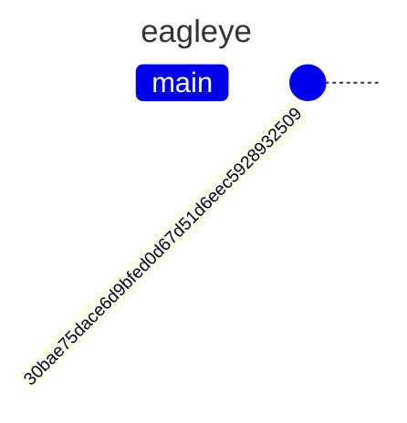


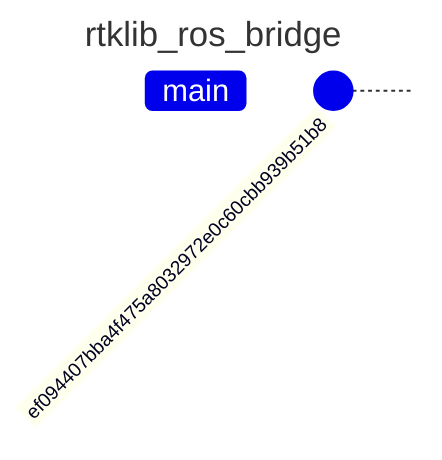


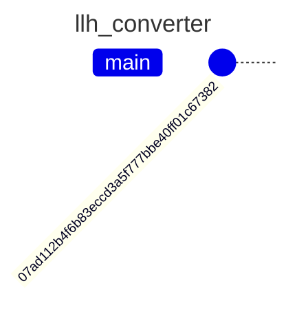


```mermaid
---
title: autoware_launch
---
gitGraph
       commit id: "681f5f76a425c845bf23258ad9d5a89104105475"
       commit id: "5d8a2f0d6cfd715c6ef01daa007e3748edbf6b7a"
       commit id: "7d3f1d2359402f73b29762c05e8e4a8e58fb388a"
       commit id: "76dcd5435904f19b8f22baf06749cb6b86605bd4"
       commit id: "06cd7431e27a5fd0aaff3c881d79f7158e74a567"
       commit id: "434f95a1037d777b2e3ee5ded041449397d5da9b"
       commit id: "b811253344e8599fb8a3134a6c0552b69f3aa4ba"
       commit id: "307dc94a121f6f22ed7fc810665e1ba3adf9bdfa"
       commit id: "d95d929a3968c08dc25f95cc83c4260d147f7d11"
       commit id: "807e5c68fd1cef535afac4b0d6408a86d7ba62ea"
       commit id: "5b9dfdbc0a5043ba5c43bddc97ddea9ebff04c22"
       commit id: "26148188f74271adbb0f96ceab03d91d564adb9b"
       commit id: "eeccf72060e0c9402699c822c591c35b6b4c761a"
       commit id: "be567283e01842201e912d4e4bfcbd8d99e3131b"
       commit id: "198f929dd6e0585335d38cbcecd30f2891513743"
       commit id: "9d9eb334818b0eb8b42d4d0f8d676626f19da381"
       commit id: "2c08bc6586a81f13d1e08da8d70cfc4b255864c6"
       commit id: "347b2939ffdc9dc00effe897c1a0eff6c16c74f1"
       commit id: "cbe4ed8763f6c33dff67e91ebeb5bd4e6250f5b6"
       commit id: "fd15eb88fe1759d90390b93a7a20a63a345c4393"
       commit id: "0ac076d32e8902623c52cc6a66c0ff8d8bb56018"
       commit id: "811307d605eb2983d4ab669e9ed3cb24a862ee80"
       commit id: "5cba1dabfad5dbd6bdbbe446f90cd96db61f9da9"
       commit id: "c1edaf9d71ffa9a653ba7fce376a93f8f5f64276"
       commit id: "cc47affb1346db5e638ae27736897f3fa03a264f"
       commit id: "b951b5190232b3bd36b982a355dbbe6041e0b0f3"
       commit id: "dee409f7716b324a29e43dc9a3bf6f14fa5968af"
       commit id: "3fa16a194159cfca6664b293d4e6bb73a86b6c7a"
       commit id: "c1e98dde3f7d6b0c89b29c97376c83cb349a73e9"
       commit id: "da1cfda260d9f488ce617b916f687e42400b0a9e"
       commit id: "901a04495f77488f0fa630e621dbd95b36e3ebbe"
       commit id: "206d439e074eda2c9c0faedef84e3bbfa55fa93d"
       commit id: "40281243c5ebb012ed9f261ae77a1982c0f72ad4"
       commit id: "557b4ccac99b913cda971844fb1736e0465657b5"
       commit id: "6b6f00622e67a23886672850119b5a51dd502554"
       commit id: "051da834e9aaf0fdec46175a9ddc09ba7637cced"
       commit id: "3d050e3cc65de2f01b9c61ffbf6cb4324350ff73"
       commit id: "f9edba40b5f101d4304ee97920d5b4b1a43ad379"
       commit id: "98da1a0eaa814b11a0da6b05d12c3e740482539b"
       commit id: "97d8d601e03a6f93f68dab8e8ed01afb0a6fee2b"
       commit id: "4dd0acab6cd58353bbed3c0ae46415c46b19c833"
       commit id: "bf07c8aeb6bb1aa42f0e3e6db2eb5e39cdc5377e"
       commit id: "45f7e581cbc17cdf82737c2c12cd5e7576c90773"
       commit id: "5b7e16cc0c34159202b5ce6e29bcad6212a9d02b"
       commit id: "50175784389ea1d3bb4fc31269d363a5ddbb5d21"
       commit id: "f4ed3ba8d97affb76b11fa38044238ac21af6b51"
       commit id: "36820f2547187aabe727d6624ce04adb5b715388"
       commit id: "34b006265a453a0ed094ed60fe52efe4cb0431e3"
       commit id: "49e260eb19397ff0eda99b22b445ecb514d4f9b2"
       commit id: "7dbcf0a450f15796f35b21b883aac0a016f0cda0"
       commit id: "76a3f658add1e040c7872648385a5283a4ff0be7"
       commit id: "6e1174a405888b5242617aa02c6620fdf20b0dcd"
       commit id: "b7dc59efc310ea0b637492dda8df8db9a59902ae"
       commit id: "484b7eabc3d84b9e7aa6dcc35f3d159d068d2cfd"
       commit id: "b5e61161467e8ac39ebf69edc806229fd00fca73"
       commit id: "86aa396e604f93e0301b68ca495c8172bf7502a1"
```


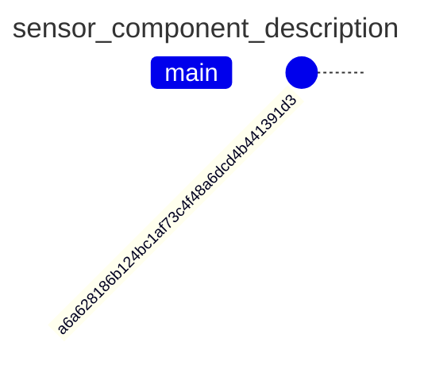


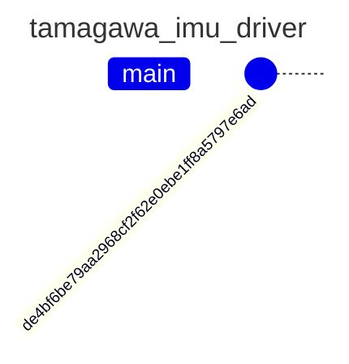


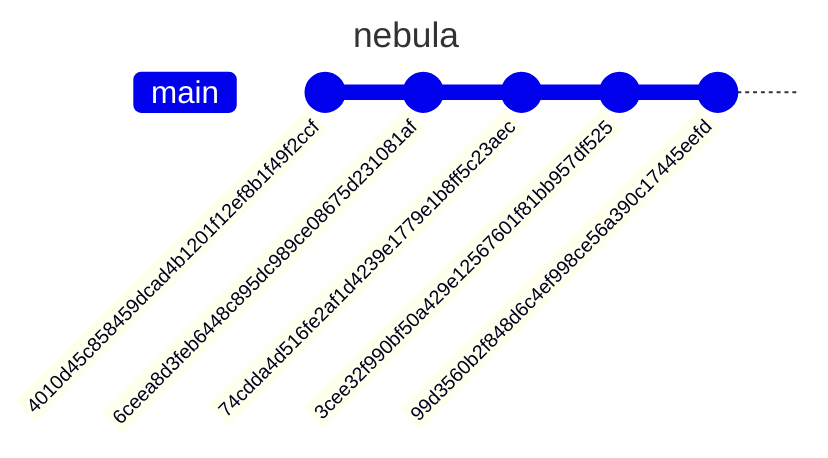


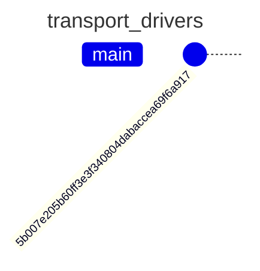


```mermaid
---
title: sample_sensor_kit_launch
---
gitGraph
       commit id: "a68b35f917663af4ac64ad55b0ce35b34744f946"
       commit id: "0ecfd223f0a731cbe3f0db7c28c120549779f86c"
```


```mermaid
---
title: awsim_sensor_kit_launch
---
gitGraph
       commit id: "38635b8aac81e3eeb0c560f8e7d51dc45ee0e342"
       commit id: "27992fecbb9ebafe9ff3515aa0f01c1306e127ee"
```


```mermaid
---
title: sample_vehicle_launch
---
gitGraph
       commit id: "627068935b12ec6d6121e6a1b885e31d564b04c5"
```


```mermaid
---
title: pacmod_interface
---
gitGraph
       commit id: "664a58db456e092659e5b25954fbf525593bf10d"
```


```mermaid
---
title: autoware_individual_params
---
gitGraph
       commit id: "bfc7e159cb040f2abcf39954ede326ecebd86749"
```


```mermaid
---
title: heaphook
---
gitGraph
       commit id: "0c4836c3d1398ca898e5300cbf2270184148ae99"
```


